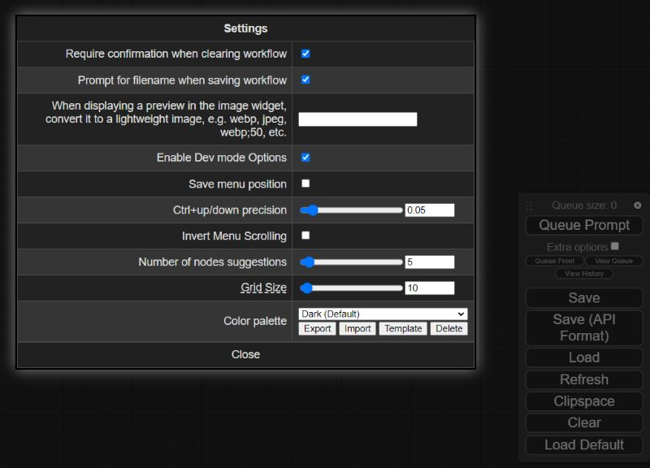

## ComfyUI-to-Python-Extension

The `ComfyUI-to-Python-Extension` is a powerful tool that translates ComfyUI workflows into executable Python code. Designed to bridge the gap between ComfyUI's visual interface and Python's programming environment, this script facilitates the seamless transition from design to code execution. Whether you're a data scientist, a software developer, or an AI enthusiast, this tool streamlines the process of implementing ComfyUI workflows in Python. The output makes it easy to queue a large amount of images for generation and provides a base script to easily modify for experimination.

**Convert this:**


**To this:**

```
import os
import random
import sys
from typing import Sequence, Mapping, Any, Union
import torch


def add_comfyui_directory_to_sys_path() -> None:
    """
    Recursively looks at parent folders starting from the current working directory until it finds 'ComfyUI'.
    Once found, the directory is added to sys.path.
    """
    start_path = os.getcwd()  # Get the current working directory

    def search_directory(path: str) -> None:
        # Check if the current directory contains 'ComfyUI'
        if "ComfyUI" in os.listdir(path):
            directory_path = os.path.join(path, "ComfyUI")
            sys.path.append(directory_path)
            print(f"ComfyUI found and added to sys.path: {directory_path}")

        # Get the parent directory
        parent_directory = os.path.dirname(path)

        # If the parent directory is the same as the current directory, we've reached the root and stop the search
        if parent_directory == path:
            return

        # Recursively call the function with the parent directory
        search_directory(parent_directory)

    # Start the search from the current working directory
    search_directory(start_path)


def get_value_at_index(obj: Union[Sequence, Mapping], index: int) -> Any:
    """Returns the value at the given index of a sequence or mapping.

    If the object is a sequence (like list or string), returns the value at the given index.
    If the object is a mapping (like a dictionary), returns the value at the index-th key.

    Some return a dictionary, in these cases, we look for the "results" key

    Args:
        obj (Union[Sequence, Mapping]): The object to retrieve the value from.
        index (int): The index of the value to retrieve.

    Returns:
        Any: The value at the given index.

    Raises:
        IndexError: If the index is out of bounds for the object and the object is not a mapping.
    """
    try:
        return obj[index]
    except KeyError:
        return obj["result"][index]


add_comfyui_directory_to_sys_path()
from nodes import (
    CLIPTextEncode,
    KSamplerAdvanced,
    CheckpointLoaderSimple,
    VAEDecode,
    SaveImage,
    EmptyLatentImage,
    NODE_CLASS_MAPPINGS,
)


def main():
    with torch.inference_mode():
        checkpointloadersimple = CheckpointLoaderSimple()
        checkpointloadersimple_4 = checkpointloadersimple.load_checkpoint(
            ckpt_name="sd_xl_base_1.0.safetensors"
        )

        emptylatentimage = EmptyLatentImage()
        emptylatentimage_5 = emptylatentimage.generate(
            width=1024, height=1024, batch_size=1
        )

        cliptextencode = CLIPTextEncode()
        cliptextencode_6 = cliptextencode.encode(
            text="Kylo Ren trapped inside of a Mark Rothko painting",
            clip=get_value_at_index(checkpointloadersimple_4, 1),
        )

        cliptextencode_7 = cliptextencode.encode(
            text="text, watermark", clip=get_value_at_index(checkpointloadersimple_4, 1)
        )

        checkpointloadersimple_12 = checkpointloadersimple.load_checkpoint(
            ckpt_name="sd_xl_refiner_1.0.safetensors"
        )

        cliptextencode_15 = cliptextencode.encode(
            text="Kylo Ren trapped inside of a Mark Rothko painting",
            clip=get_value_at_index(checkpointloadersimple_12, 1),
        )

        cliptextencode_16 = cliptextencode.encode(
            text="text, watermark",
            clip=get_value_at_index(checkpointloadersimple_12, 1),
        )

        ksampleradvanced = KSamplerAdvanced()
        vaedecode = VAEDecode()
        saveimage = SaveImage()

        for q in range(10):
            ksampleradvanced_10 = ksampleradvanced.sample(
                add_noise="enable",
                noise_seed=random.randint(1, 2**64),
                steps=25,
                cfg=8,
                sampler_name="euler",
                scheduler="normal",
                start_at_step=0,
                end_at_step=20,
                return_with_leftover_noise="enable",
                model=get_value_at_index(checkpointloadersimple_4, 0),
                positive=get_value_at_index(cliptextencode_6, 0),
                negative=get_value_at_index(cliptextencode_7, 0),
                latent_image=get_value_at_index(emptylatentimage_5, 0),
            )

            ksampleradvanced_11 = ksampleradvanced.sample(
                add_noise="disable",
                noise_seed=random.randint(1, 2**64),
                steps=25,
                cfg=8,
                sampler_name="euler",
                scheduler="normal",
                start_at_step=20,
                end_at_step=10000,
                return_with_leftover_noise="disable",
                model=get_value_at_index(checkpointloadersimple_12, 0),
                positive=get_value_at_index(cliptextencode_15, 0),
                negative=get_value_at_index(cliptextencode_16, 0),
                latent_image=get_value_at_index(ksampleradvanced_10, 0),
            )

            vaedecode_17 = vaedecode.decode(
                samples=get_value_at_index(ksampleradvanced_11, 0),
                vae=get_value_at_index(checkpointloadersimple_12, 2),
            )

            saveimage_19 = saveimage.save_images(
                filename_prefix="ComfyUI", images=get_value_at_index(vaedecode_17, 0)
            )


if __name__ == "__main__":
    main()
```

## Usage


1. Navigate to your `ComfyUI` directory

2. Clone this repo
    ```bash
    git clone https://github.com/pydn/ComfyUI-to-Python-Extension.git
    ```

    After cloning the repo, your `ComfyUI` directory should look like this:
    ```
    /comfy
    /comfy_extras
    /ComfyUI-to-Python-Extension
    /custom_nodes
    /input
    /models
    /output
    /script_examples
    /web
    .gitignore
    LICENSE
    README.md
    comfyui_screenshot.png
    cuda_mollac.py
    execution.py
    extra_model_paths.yaml.example
    folder_paths.py
    latent_preview.py
    main.py
    nodes.py
    requirements.txt
    server.py
    ```

3. Navigate to the `ComfyUI-to-Python-Extension` folder and install requirements
    ```bash
    pip install -r requirements.txt
    ```

4. Launch ComfyUI, click the gear icon over `Queue Prompt`, then check `Enable Dev mode Options`. **THE SCRIPT WILL NOT WORK IF YOU DO NOT ENABLE THIS OPTION!**



5. Load up your favorite workflows, then click the newly enabled `Save (API Format)` button under Queue Prompt

6. Move the downloaded .json workflow file to your `ComfyUI/ComfyUI-to-Python-Extension` folder

7. If needed, update the `input` variable at the bottom of `comfyui_to_python.py` to match the name of your .json workflow file. By default, the script will look for a file called `workflow_api.json`. You can also update the `queue_size` variable to your desired number of images that you want to generate in a single script execution. By default, the scripts will generate 10 images.

8. Run the script:
   ```bash
   python comfyui_to_python.py
   ```

9. After running `comfyui_to_python.py`, a new .py file will be created in the current working directory that contains the same name as the `input` variable. If you made no changes, look for `workflow_api.py`.

10. Now you can execute the newly created .py file to generate images without launching a server.
